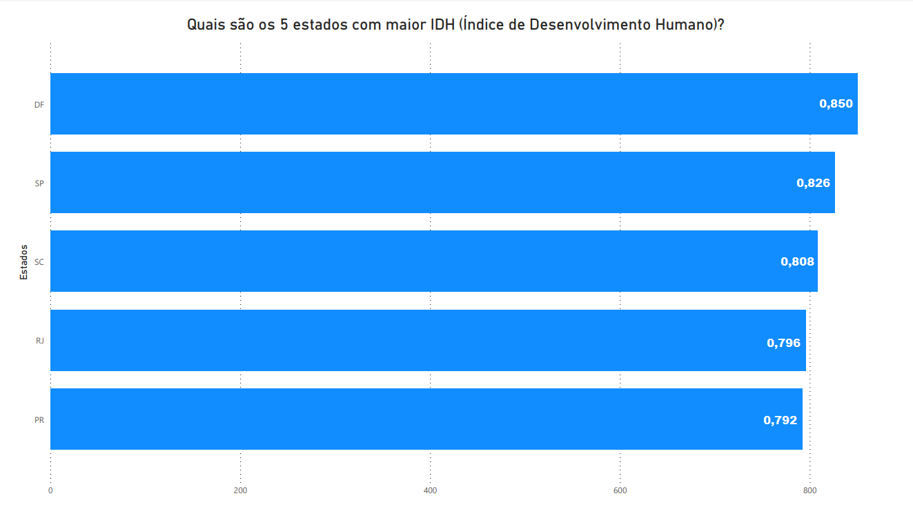
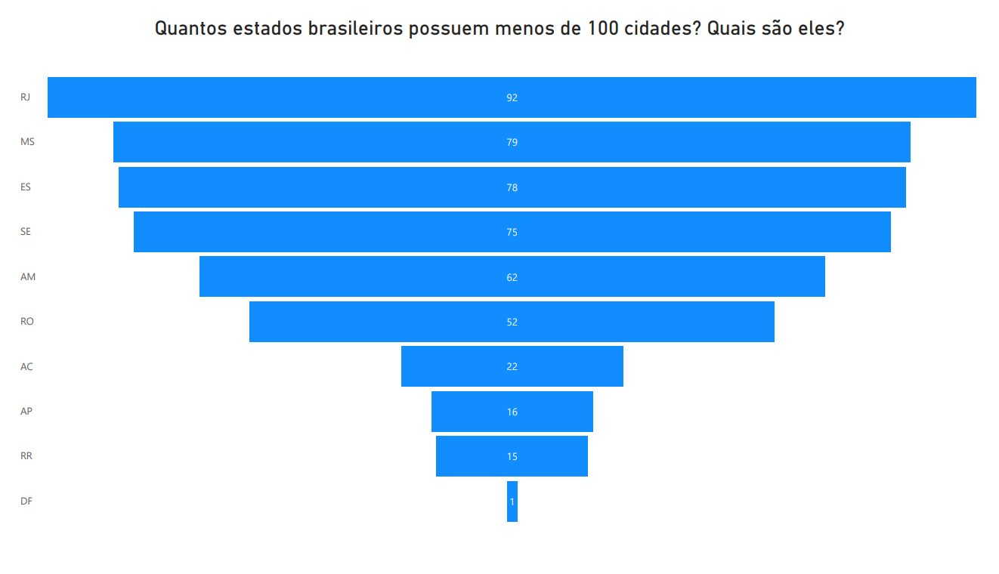
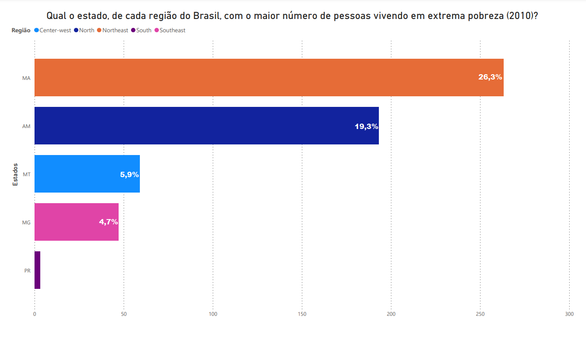
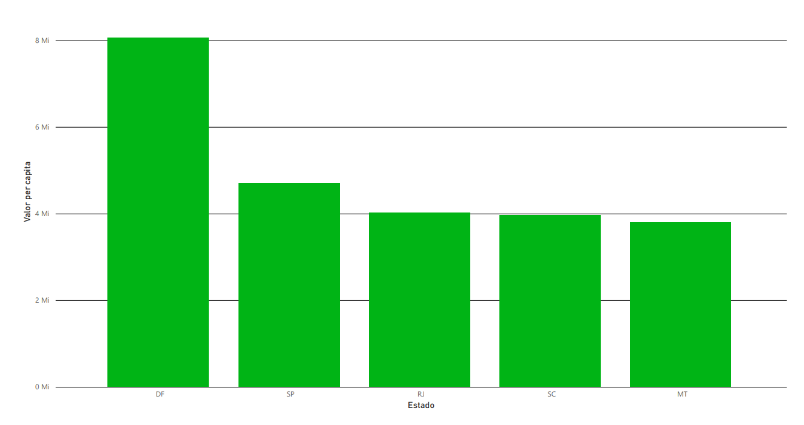
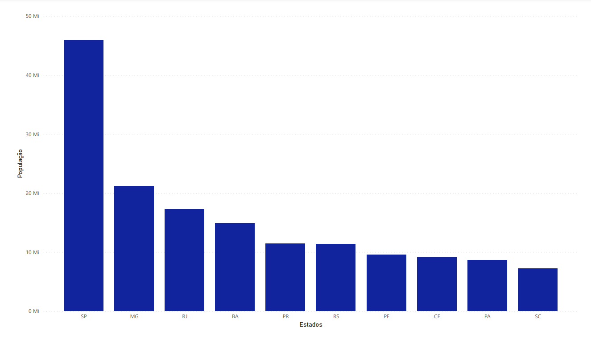

 # Sobre o projeto

O objetivo era criar uma padronização a partir de um conjunto de dados escolhido por nós e, então, realizar um brainstorm sobre perguntas que poderiam ser respondidas pelos dados, criar a modelagem do banco de dados e também criar visualizações de dados a partir de gráficos. Nos foi fornecido diversos temas, porém, nosso squad decidiu pesquisar por um tema diferente que nos melhor agradasse. 

# Sobre o tema escolhido

Escolhemos uma base de dados que contém diversas informações sobre os estados do Brasil. As informações têm como fonte o IBGE. Os dados foram retirados deste site: encurtador.com.br/EH125

## Explicação sobre algumas perguntas

### 👉 O que é o Índice de Desenvolvimento Humano (IDH)?

 Possui um índice que varia de 0 a 1. Quanto mais próximo de 1, melhor é o IDH. Nesse índice é medido: expectativa de vida, as maiores taxas de alfabetização e indicadores de renda per capita.

Há cinco faixas do IDH:
* 0,000 – 0,499 – Muito Baixo
* 0,500 – 0,599 – Baixo
* 0,600 – 0,699 – Médio
* 0,700 – 0,799 – Alto
* 0,800 – 1,000 – Muito Alto

### 👉 O que é categorizado como extrema pobreza (2010)? 

Considerando que, em 2010, o salário mínimo era de R$510, era entendido que viver em extrema pobreza estava na faixa de R$70 per capita. 

### 👉 O que é PIB per capita? 

O **PIB per capita** é o produto interno bruto dividido pela quantidade de habitantes. No caso usado na pergunta, é o número de habitantes de cada estado.

# Perguntas realizadas:

| <h3>Quais são os 5 estados com maior IDH (Índice de Desenvolvimento Humano) (2019)?</h3> | 
|----------------| 
|  |

| <h3>Quantos estados brasileiros possuem menos de 100 cidades? Quais são eles?</h3> |
|----------------| 
|  |

| <h3>Qual o estado, de cada região do Brasil, com o maior número de pessoas vivendo em extrema pobreza (2010)?</h3> |
|----------------|
|  |

| <h3>Qual são os 5 estados com maior PIB per capita do Brasil? (2019)</h3> |
|----------------|
|  |

| <h3>Quais são os 10 estados brasileiros com maior população (2019)?</h3> |
|----------------|
|  |

# 🛠 Ferramentas utilizadas

